# LangFlow Chat 智能知识问答管理系统 - 页面展示

## 项目概述

LangFlow Chat 是一个基于 Vue 3 + Vite + Electron 的智能知识问答管理系统，提供智能问答、知识库构建、文档管理和模型广场等核心功能。系统采用现代化的UI设计，支持桌面端和Web端部署。

数字人及智能体前后端项目分别放在两个代码仓库：

1.前端代码仓库： https://github.com/Yancheng-s/KnowledgeBaseQA_Front

2.后端代码仓库： https://github.com/Yancheng-s/KnowledgeBaseQA_Back

## 技术栈

- **前端框架**: Vue 3 + TypeScript
- **构建工具**: Vite
- **桌面应用**: Electron
- **UI组件**: Element Plus
- **样式框架**: Tailwind CSS
- **路由管理**: Vue Router
- **HTTP客户端**: Axios
- **图标库**: Font Awesome

## 页面展示

### 全页面一览

| 功能模块 | 页面路径 | 文件名约定 | 预览 |
|---|---|---|---|
| 主页面 | / | `main-page.png` | 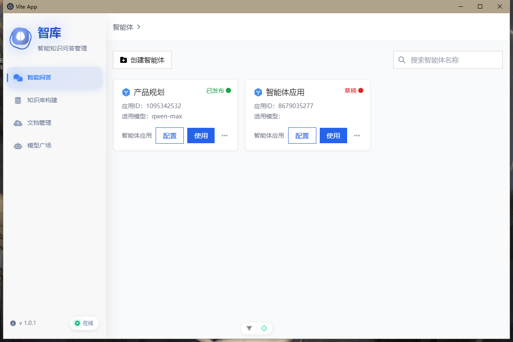 |
| 智能问答窗口页面 | /chat | `chat.png` | 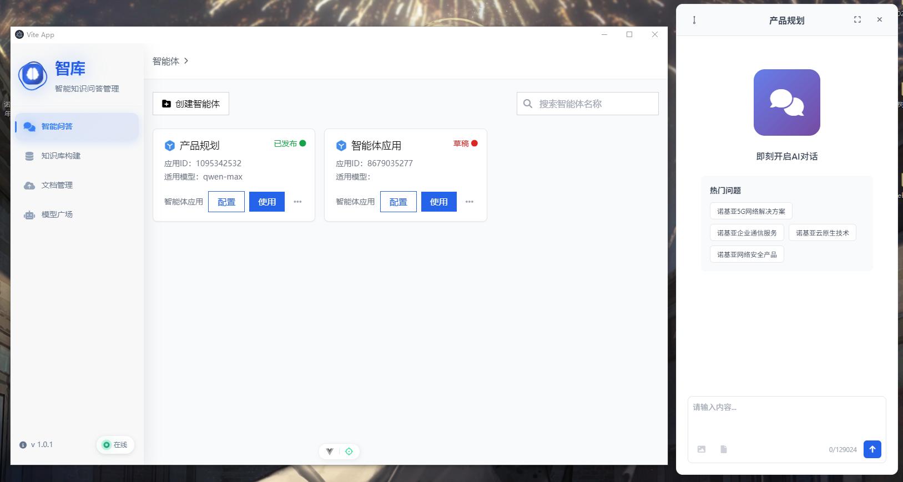 |
| 智能问答全屏界面 | /chat | `chat-conversation.png` | 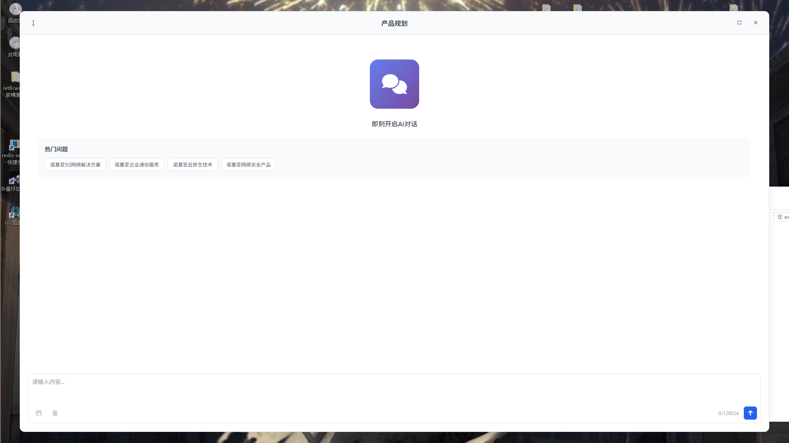 |
| 智能体列表 | /chat | `agent-list.png` |  |
| 创建智能体 | /chat | `create-agent.png` | 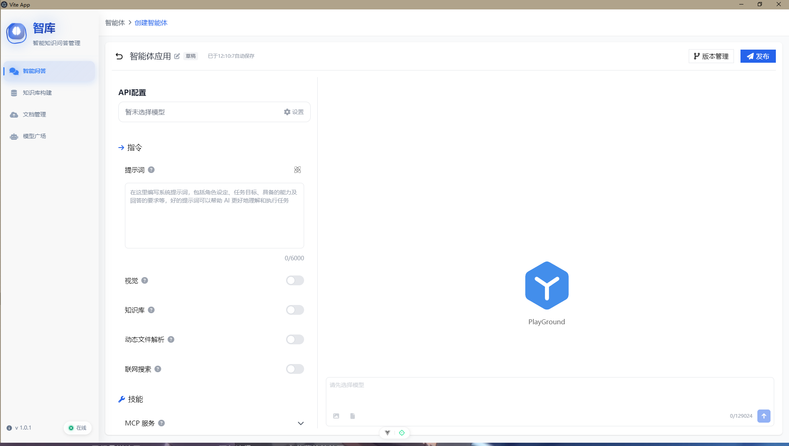 |
| 智能体配置 | /chat | `agent-config.png` | 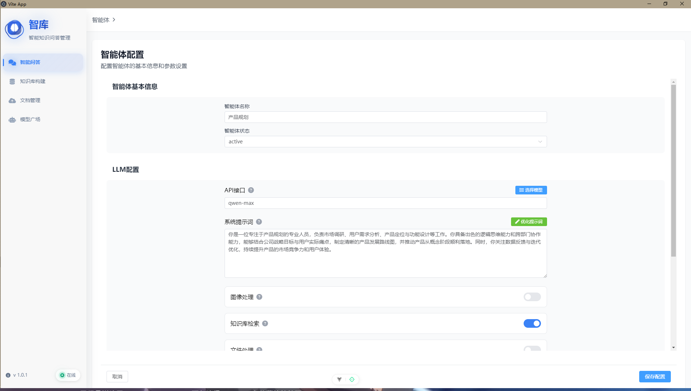 |
| 知识库列表 | /knowledge | `knowledge-list.png` | 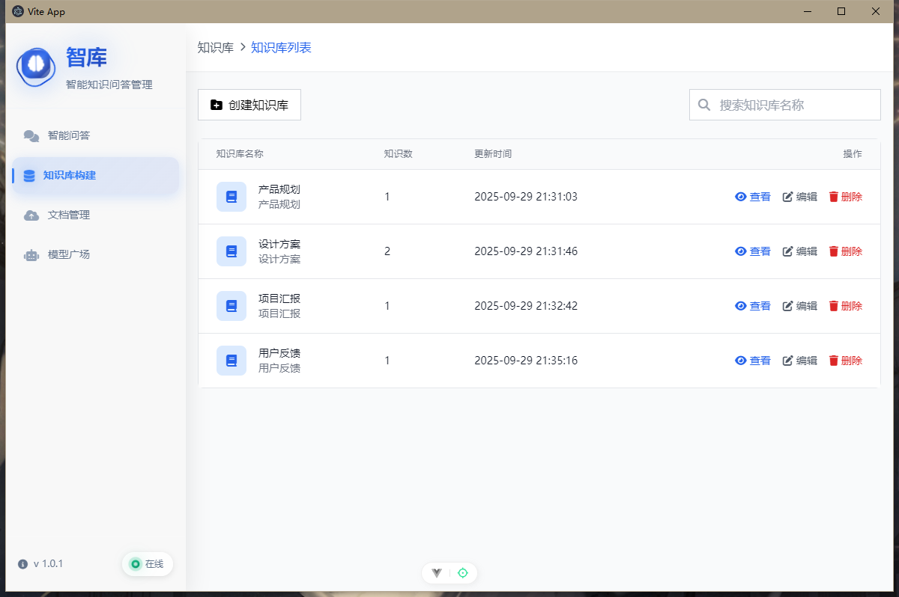 |
| 创建知识库-步骤1 | /knowledge | `create-knowledge-1.png` | 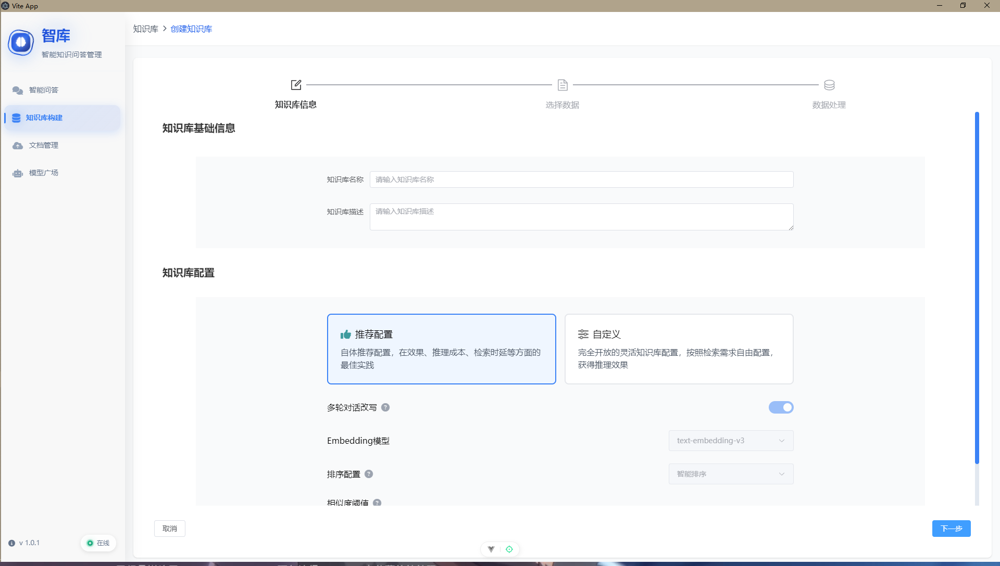 |
| 创建知识库-步骤2 | /knowledge | `create-knowledge-2.png` | 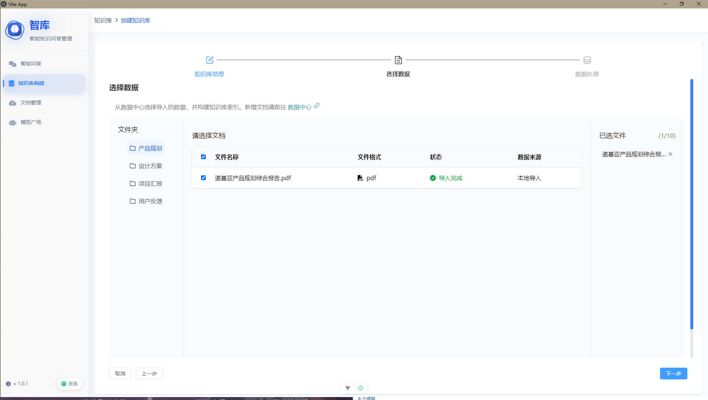 |
| 创建知识库-步骤3 | /knowledge | `create-knowledge-3.png` | 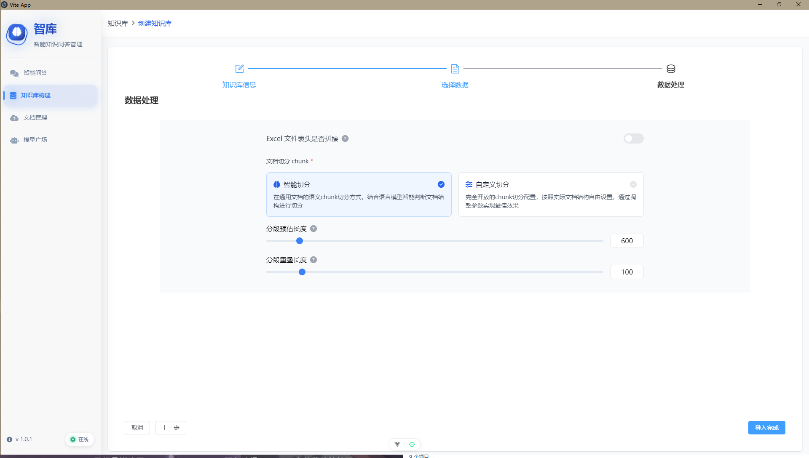 |
| 知识库详情 | /knowledge | `knowledge-detail.png` | 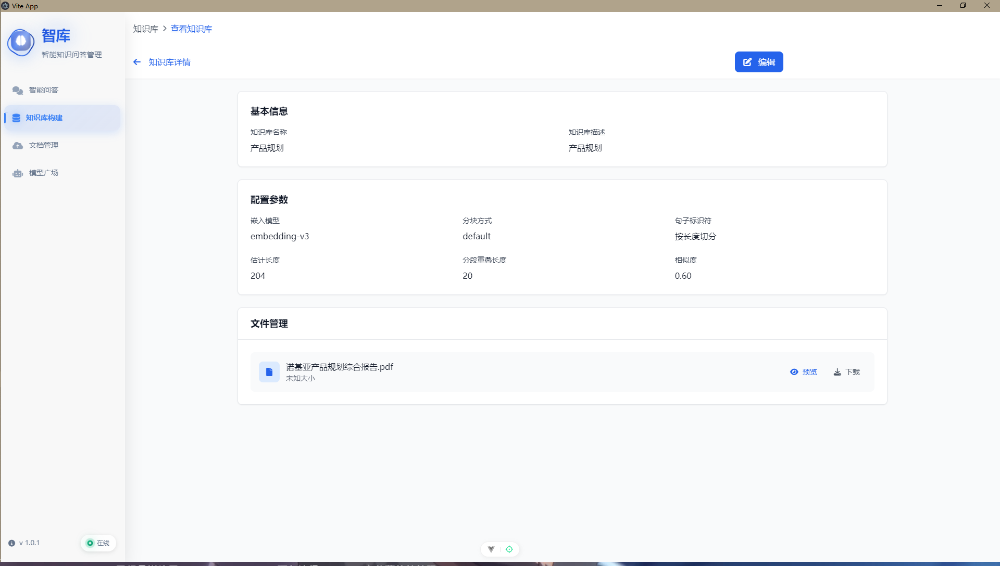 |
| 知识库编辑 | /knowledge | `knowledge-edit.png` | 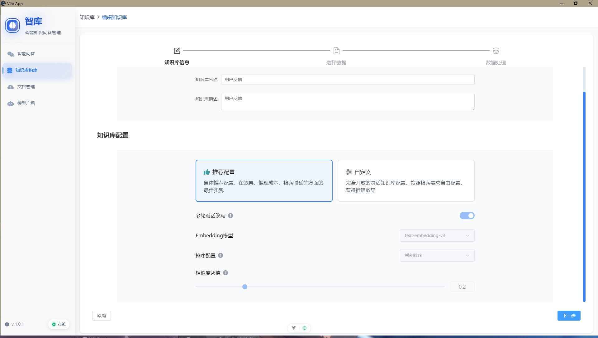 |
| 文档管理 | /upload | `document-management.png` | 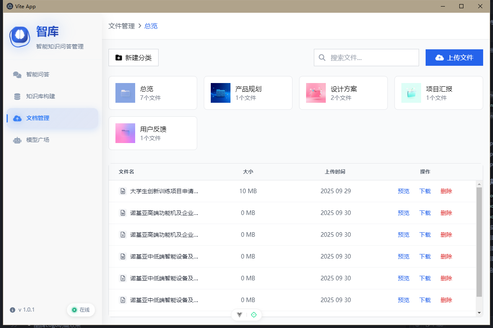 |
| 文件上传 | /upload | `file-upload.png` | 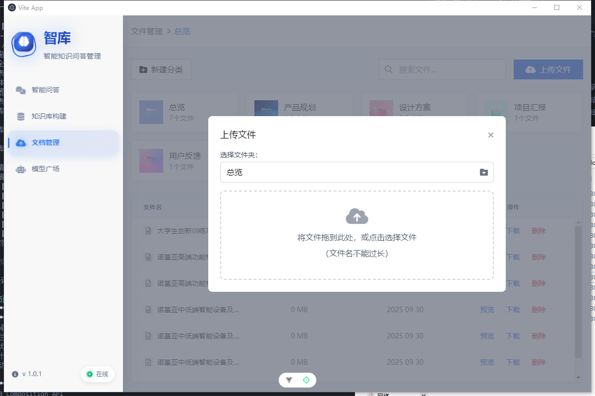 |
| 文件预览-工具选择 | /upload | `file-preview-list.png` | 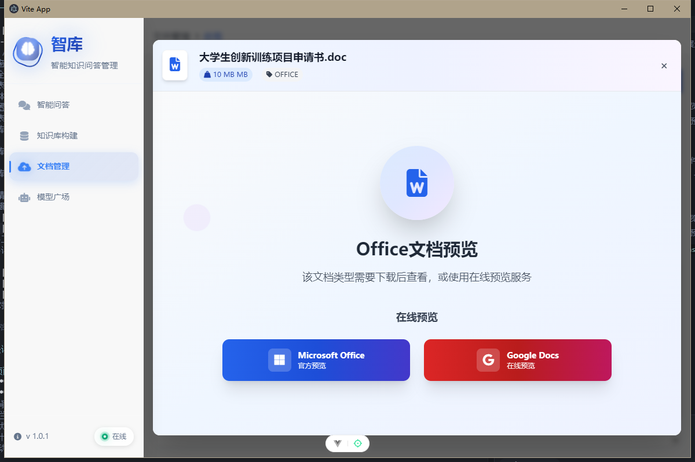 |
| 文件预览-详情视图 | /upload | `file-preview-detail.png` | 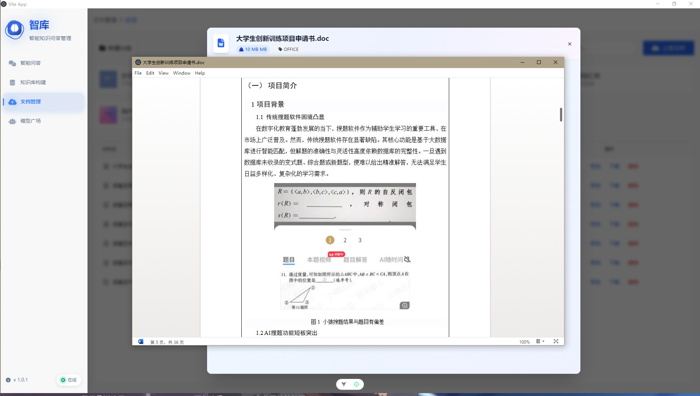 |
| 模型广场 | /models | `model-square.png` | 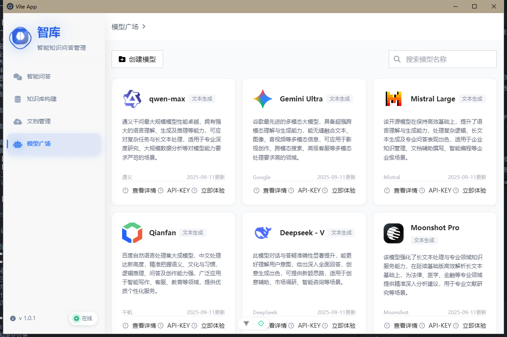 |

> 截图存放路径：**`docs/assets/`**，命名务必与上表一致，推送后即自动加载。

## 功能模块详解

### 1. 主页面 (/)
**功能描述**: 系统主入口页面，包含左侧导航栏和右侧内容区域
**主要特性**:
- 动态渐变背景效果
- 左侧导航栏包含4个主要功能模块
- 实时网络状态显示
- 响应式设计，支持不同屏幕尺寸
- 品牌Logo动画效果

**技术实现**:
- 使用Vue 3 Composition API
- CSS3动画和渐变效果
- 网络状态监听
- 路由导航管理

### 2. 智能问答模块 (/chat)
**功能描述**: 智能问答系统的核心功能，支持创建和管理智能体
**主要特性**:
- 智能体列表展示
- 创建新智能体
- 智能体配置管理
- 实时对话功能
- 支持多种AI模型

**子页面**:
- **智能体列表**: 展示所有可用的智能体
- **创建智能体**: 创建新的智能体配置
- **智能体配置**: 配置智能体的参数和行为
- **智能体详情**: 查看智能体的详细信息

### 3. 知识库构建模块 (/knowledge)
**功能描述**: 知识库管理系统，支持创建、编辑和管理知识库
**主要特性**:
- 知识库列表管理
- 创建新知识库
- 知识库内容编辑
- 知识库详情查看
- 支持多种文档格式

**子页面**:
- **知识库列表**: 展示所有知识库
- **创建知识库**: 创建新的知识库
- **知识库详情**: 查看知识库的详细信息
- **知识库编辑**: 编辑知识库内容

### 4. 文档管理模块 (/upload)
**功能描述**: 文档上传和管理系统
**主要特性**:
- 文件上传功能
- 文件预览功能
- 文档格式支持
- 文件管理操作

**子页面**:
- **文档管理**: 文档列表和管理界面
- **文件上传**: 文件上传界面
- **文件预览**: 文件预览功能

### 5. 模型广场模块 (/models)
**功能描述**: AI模型管理和选择系统
**主要特性**:
- 模型列表展示
- 添加新模型
- 模型配置管理
- 模型选择对话框

**子页面**:
- **模型列表**: 展示所有可用模型
- **添加模型**: 添加新的AI模型
- **模型选择对话框**: 模型选择界面

## 设计特色

### 1. 视觉设计
- **现代化UI**: 采用现代化的设计语言，界面简洁美观
- **渐变背景**: 动态渐变背景效果，提升视觉体验
- **动画效果**: 丰富的CSS3动画效果，提升用户交互体验
- **响应式设计**: 支持不同屏幕尺寸的适配

### 2. 交互设计
- **直观导航**: 清晰的导航结构，用户易于理解和使用
- **实时反馈**: 操作反馈及时，用户体验良好
- **状态管理**: 完善的组件状态管理
- **错误处理**: 友好的错误提示和处理机制

### 3. 技术特色
- **组件化开发**: 高度组件化的开发模式
- **TypeScript支持**: 完整的TypeScript类型支持
- **模块化架构**: 清晰的模块化架构设计
- **性能优化**: 多种性能优化策略

## 部署说明

### 开发环境
```bash
# 安装依赖
npm install

# 启动开发服务器
npm run dev

# 启动Electron开发模式
npm run electron-dev
```

### 生产环境
```bash
# 构建Web版本
npm run build

# 构建Electron应用
npm run electron-build
```

## 项目结构

```
src/
├── api/                    # API接口
├── assets/                 # 静态资源
├── components/             # 组件
│   ├── FAQ/               # 智能问答组件
│   ├── KBS/               # 知识库组件
│   └── ModelSelect/       # 模型选择组件
├── routes/                # 路由配置
├── utils/                 # 工具函数
└── vue/                   # Vue页面
```

## 更新日志

### v1.0.1
- 初始版本发布
- 支持智能问答功能
- 支持知识库管理
- 支持文档管理
- 支持模型广场
- 支持Electron桌面应用

## 联系方式

如有问题或建议，请联系开发团队。

---

注意：本项目正在积极开发中，功能可能会有所变化。请关注最新更新。
